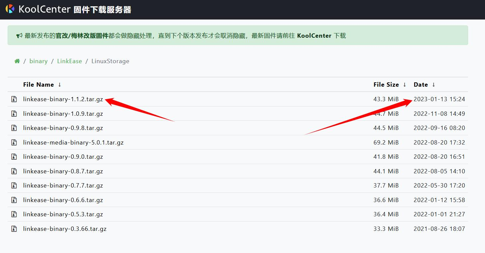
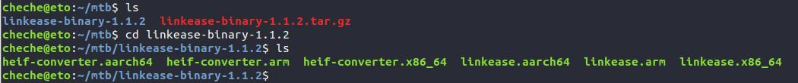
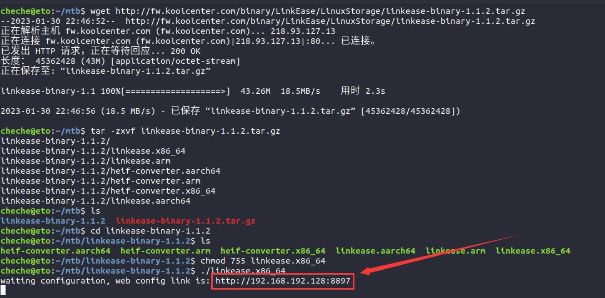

### Linux 通用版

**1.首先在命令窗口中登录您的linux系统**

**2.在光标后输入“cd mtb” ，点击回车，进入mtb目录中。输入“ls”确认；**
 <table><tr><td bgcolor=#bae2fe>cd mtb</td></tr></table>

mtb为存放Linux易有云存储端的目录，根据自身实际情况，可新建任意目录。

**3.在光标后输入"wget 存储端链接"，点击回车，下载易有云存储端。输入“ls”确认；**
 <table><tr><td bgcolor=#bae2fe>wget 
https://fw.koolcenter.com/binary/LinkEase/LinuxStorage/linkease.amd64</td></tr></table>

若您使用的是arm架构的Linux，则命令为：
 <table><tr><td bgcolor=#bae2fe>wget 
https://fw.koolcenter.com/binary/LinkEase/LinuxStorage/linkease.arm</td></tr></table>

**如何获取易有云linux存储端链接：**

点击[存储端下载链接](https://fw.koolcenter.com/binary/LinkEase/LinuxStorage/)，打开易有云存储端下载链接。右键“linkease.amd64”文件，在出现的弹窗中单击“复制链接地址”，即可复制该存储端链接。

**4.在光标后输入“chmod 755 linkease.amd64”给予软件运行权限。输入“ls”确认；**
<table><tr><td bgcolor=#bae2fe>chmod 755 linkease.amd64</td></tr></table>

**5.在光标后输入“./linkease.amd64”，点击回车，运行软件；**
<table><tr><td bgcolor=#bae2fe>./linkease.amd64</td></tr></table>

**6.复制命令窗中出现的网址在浏览器中打开，即可进入易有云向导页面**

**7.安装后第一次打开，需要绑定设备，请查看 [存储端绑定教程](/zh/guide/linkease_app/bind.md)。**
