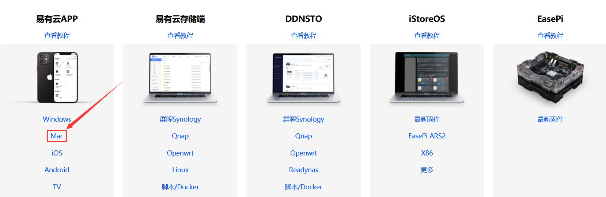

**1.点击[存储端下载](https://fw.koolcenter.com/binary/LinkEase/Client/LinkEase.dmg)，选择MacOS存储端下载；**

**2.访达——下载，找到LinkEase.dmg，点击安装；**

**3.启动台，找到易有云运行，按提示登录易有云账号，选择“本机”就能看到当前电脑上的硬盘；**

**4.然后登录手机易有云，首页——我的终端，选择“苹果图标”；**

**5.这样就能在手机端直接浏览电脑上的硬盘内容了。**

**6.MacOS存储端，不用再另外绑定，不用看下面的“存储端统一绑定教程”，打开程序界面扫码登录就成。**
