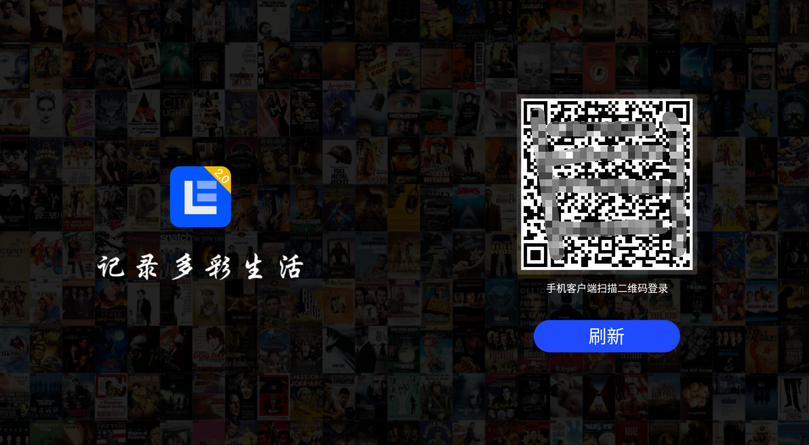
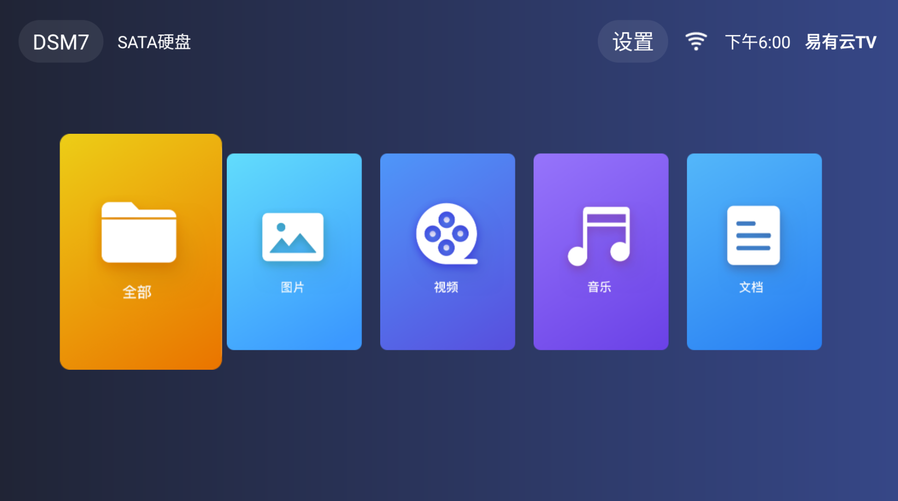
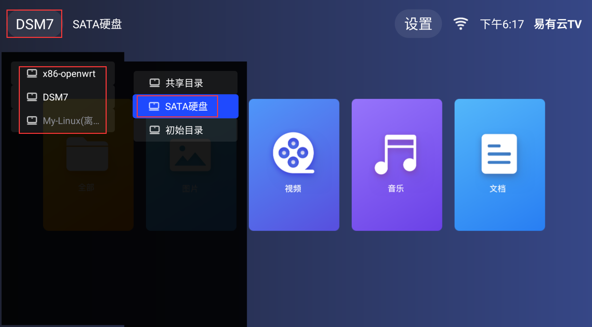
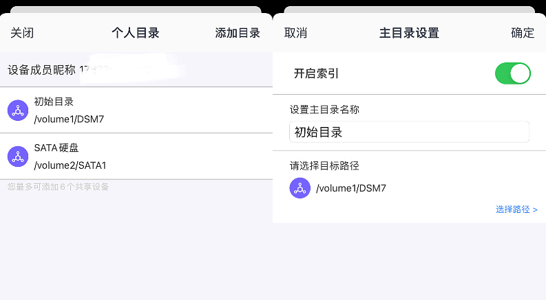
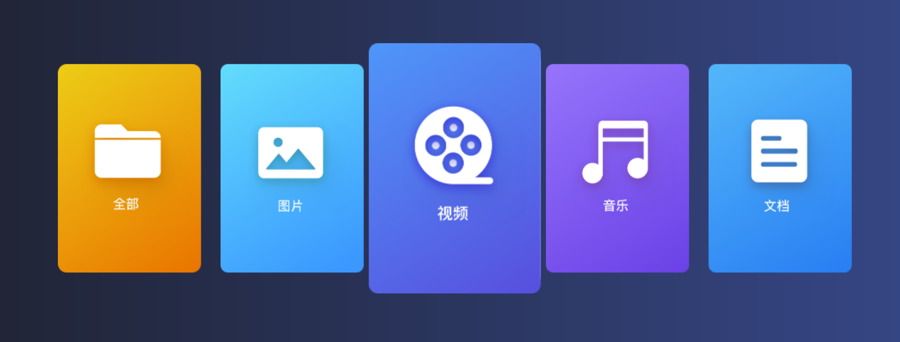

# Android TV

只针对安卓TV，目前TV客户端仅作为“文件管理器”。

* 已经在其他设备上安装好易有云存储端，TV端来浏览存储端里的文件。

#### 1.下载[TV客户端下载](https://fw.koolcenter.com/binary/LinkEase/Client/Android-tv.apk)，用U盘等安装到安卓TV上；

#### 2.安装成功后，打开“易有云TV”，用易有云App扫码登录；
  
  

#### 3.成功登录后，就是一个简单的文件浏览界面；

 

#### 4.遥控器控制光标，右上角，可以选择绑定的存储端和对应的目录。

 

#### 5.开启存储端的“索引”，方便检索出视频和音频等；

易有云App——存储端——目录管理——编辑，选择目录，启用“开启索引”，确定保存。

 

#### 6.然后就可以控制遥控器，浏览视频/音频等了。

如果视频音频等文件过多，可能没那么快检索出来，耐心等待，或者直接进“全部”里浏览。

 