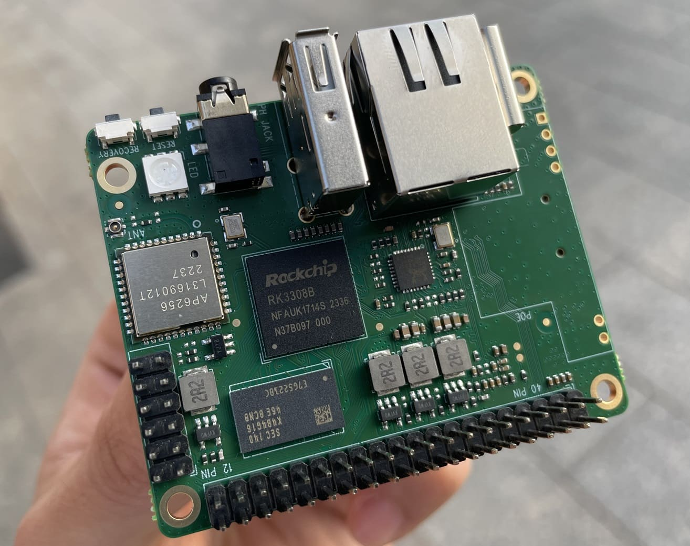

为了让大家更好的学习体验 iStoreOS，我们搞了一个便宜的小硬件 [`p2pro`](https://m.tb.cn/h.5IjiYw9UhgCX0Zy?tk=xaj8Wjs0XNg)。

 

## 快速开始

| 标题 | 文字教程 | 视频教程 | 描述 |
| :----: | :----: | :----: | :----: |
| p2pro产品优势 | [文字介绍](advantage.html) | [B站视频](todo.html) |  |
| 硬件快速上手 | TODO | [B站视频](todo.html) |  |
| 软件快速上手 | TODO | [手机快速上手](todo.html) |  |
| 问题快速解决 | [文字教程](quickfix.html) |  |  |
| 硬件产品详情 | [文字介绍](hardware.html) | 无 |  |

## 数据快速备份

| 标题 | 文字教程 | 视频教程 | 描述 |
| :----: | :----: | :----: | :----: |
| 相册快速备份 | [文字教程](/zh/guide/linkease/function/photo_backup.html) | TODO | TODO |
| 电脑快速备份 | [文字教程](/zh/guide/linkease/function/file_backup.html) | TODO | TODO |
| 网盘数据备份 | TODO | TODO | TODO |
| 数据多盘备份 | TODO | TODO | TODO |
| 磁盘阵列建议 | TODO | TODO | TODO |

## 远程解决方案

| 标题 | 文字教程 | 视频教程 | 描述 |
| :----: | :----: | :----: | :----: |
| 易有云异地组网 | [文字教程](/zh/guide/linkease/function/remote_connects.html) | TODO | TODO |
| DDNSTO远程域名 | [文字教程](/zh/guide/ddnsto/install/device/istoreos.html) | TODO | TODO |
| IPv6 动态域名 | | [多个视频分组介绍](https://www.bilibili.com/video/BV1mT4y1b73p/?vd_source=8e363fb838693d4a1c274983edfd43fc)  | TODO |
| RustDesk远程桌面 | TODO | TODO | TODO |

## HomeAssistant 智能家居玩法

| 标题 | 文字教程 | 视频教程 | 描述 |
| :----: | :----: | :----: | :----: |
| TODO | TODO | TODO | TODO |

## Docker 玩法建议

| 标题 | 文字教程 | 视频教程 | 描述 |
| :----: | :----: | :----: | :----: |
| TODO | TODO | TODO | TODO |

## 高级玩法

| 标题 | 文字教程 | 视频教程 | 描述 |
| :----: | :----: | :----: | :----: |
| 浏览器导航页 | TODO | TODO | TODO |
| 多款皮肤选择 | TODO | TODO | TODO |
| 成为路由器 | TODO | TODO | TODO |
| 开启网页桌面系统 | TODO | TODO | TODO |
 

