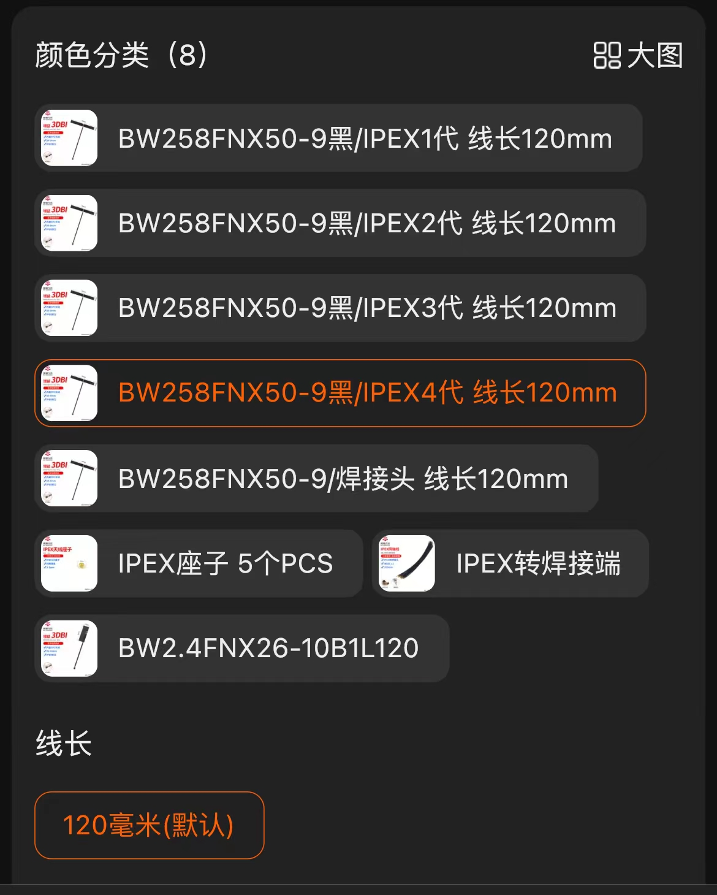

## 硬件详情

| 部件 | 详情 |
| :----: | :----: |
| 产品 | p2pro |
| CPU | RK3308B-S |
| 内存 | 512MB DDR3 |
| 无线网卡 | 正基的AP6256 |
| 有线网卡 | 100Mbps x 1个 |
| USB | USB2.0 x1 |
| 外壳 | 暂时无  |  
| TYPE-C | 用于供电  |  
| 尺寸 | 65mm x 52.5mm |

## 更多详细信息

从合作厂家[查看更多信息](http://wiki.armsom.org/index.php/ArmSoM-p2_pro)

## 天线推荐

```
【淘宝】https://m.tb.cn/h.5IzmCQq6v8RFvVY?tk=RCHCWjrgNG3 HU0854 「5G/5.8G双频wifi内置FPC全向天线 ZigBee蓝牙贴片2.4G天线可定制」
点击链接直接打开 或者 淘宝搜索直接打开
```

规格：
 