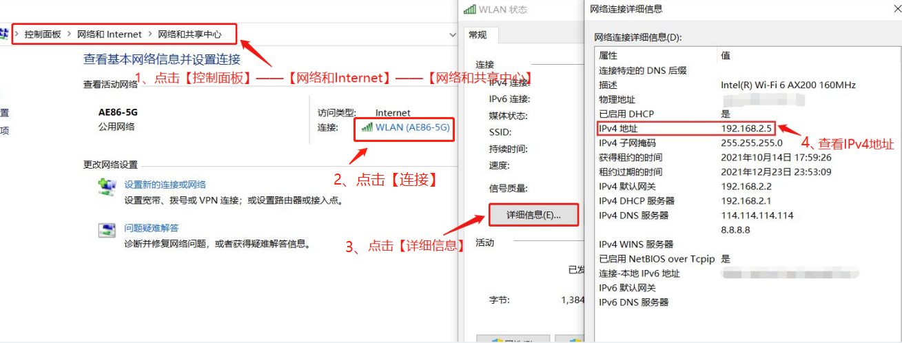
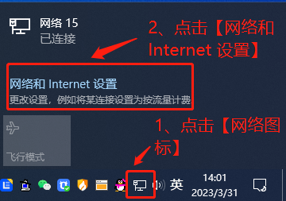
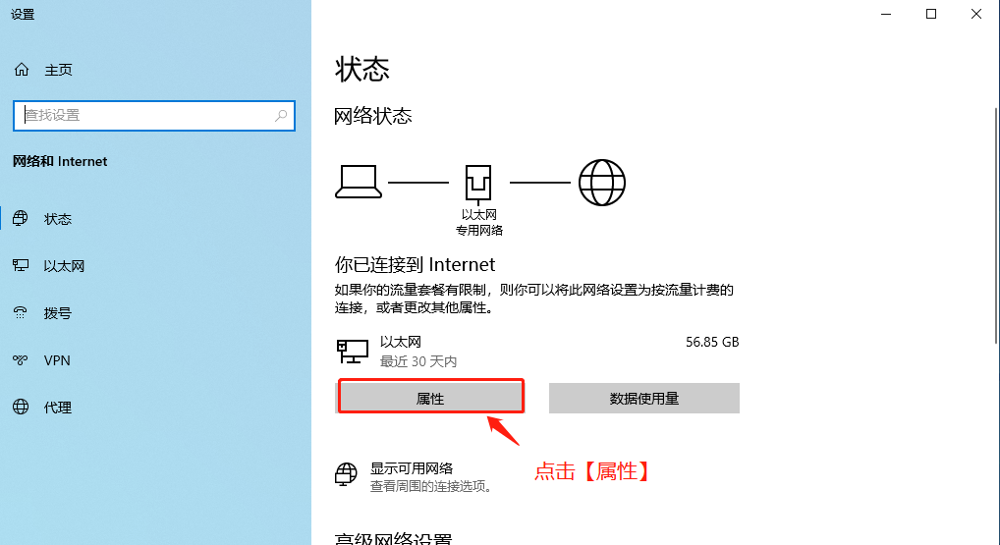
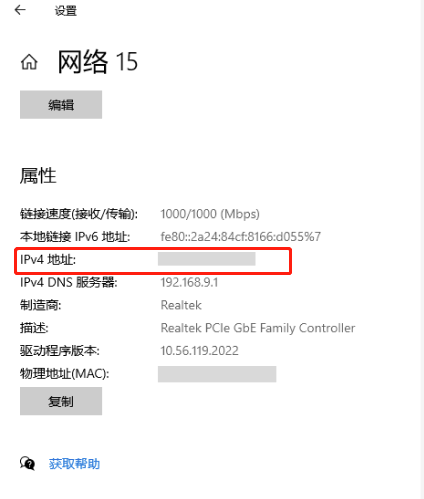
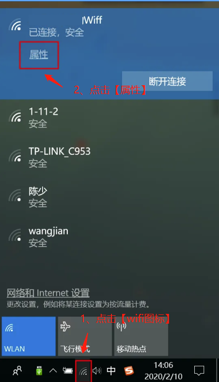
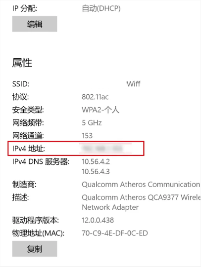

## 什么是IP地址？怎么查看电脑IP地址？

### 什么是IP地址？

人类的沟通，从知道对方的名字开始，像是小明、小芳这样的名字，便于记忆。  
但是如果遇到有重名的人，就得费力去仔细分辨，毕竟将要发给小明1号的消息，错发给了小明2号，就会比较尴尬。    
计算机王国是数字的世界，每个计算机都可以用独特的数字代表自己，完美避开了重名的烦扰。这个独特的数字，我们一般称之为IP地址。

目前IP地址有两种：  
- IPv4
IPv4是网际协议开发过程中的第四个修订版本，是应用最广泛的版本，也是互联网的核心。IPv4是一个32位长的二进制数字，即是由0和1组成的长度达32位的数字串，代表了4,294,967,296个地址，接近43亿个的IPv4地址。  
为了方便记忆，这些32位的0和1，也可以采用十进制来展示。最常用的就是：192.168.1.1。

- IPv6
IPv6是网际协议开发过程中的第六个修订版本，由互联网工程任务组（IETF）设计的，最大的用途是替代IPv4地址。

**IPv4是过去和现在，IPv6是趋势和未来。**

### 怎么查看电脑IP地址？

通常我们所说的电脑IP地址指的就是IPv4地址。

#### 方式一：通过网络状态查询
控制面板——网络和Internet——网络共享中心，点击“连接”，出来弹窗点击“详细信息”——IPv4地址。

或者直接点击右下角已经连接的网络，然后点击“属性”，找到IPv4就是你电脑的ip地址了。

### 方式二：通过已经连接的wifi查询

直接点击右下角已经连接的wifi，然后点击“属性”，找到IPv4就是你电脑的ip地址了。

