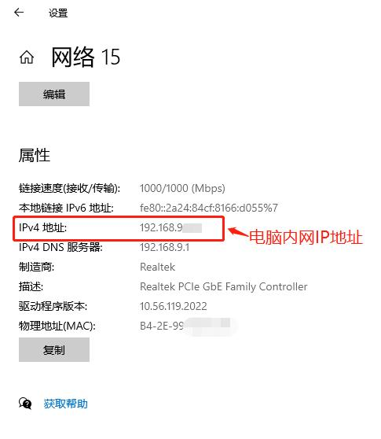

## 内网IP和公网IP的区别

### 什么是内网IP地址

内网IP地址简单来说就是你在家里、学校或公司里用的电脑专属的地址，只能在家里、学校或公司里用，不能在外面的互联网上用。

### 什么是公网IP地址

公网 IP 是指可以在互联网中任意访问的 IP 地址，它就像我们上网的“身份证”，在互联网中独一无二。有了公网 IP，我们才能够在互联网上访问各种网站和服务，例如淘宝、百度、邮箱等等。

如果你只想在家里、学校或公司里用电脑，就用内网IP地址，如果你想在互联网上用电脑，就要用公网IP地址。

