## Aria2下载器

### 设置Aria2
**以OpenWrt为例**
1. 下载好Aria2插件后，进入设置页面，点击【基本选项】，用户组要选择【root】，这样可以避免因权限问题访问不了Aria2，确认【下载目录】的路径是否存在或者是否正确。

  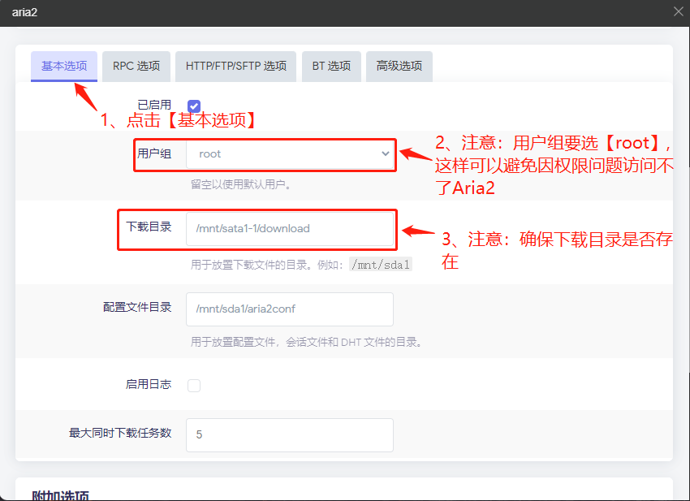

2. 点击【RPC选项】，【RPC认证方式】选择令牌，【RPC令牌】可以自己设置，最后记得点击【保存并应用】。

 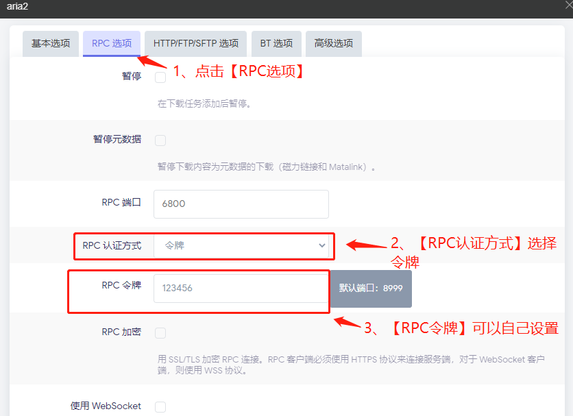

  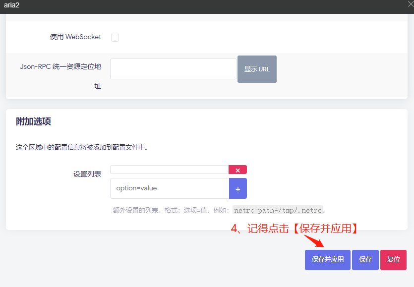

3. 进入Aria2界面，点击【AriaNg 设置】，点击【RPC】，可以查看Aria2 RPC的内网地址，记得输入Aria2 RPC 密钥（令牌）。

 

 4. 点击【Aria2 设置】，找到【BitTorrent 设置】，找到【BT 服务器地址】输入tracker链接。

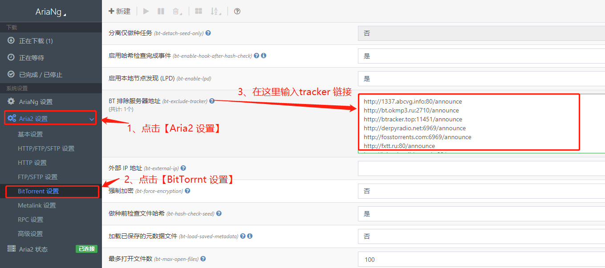

5. 点击【新建】，在【下载链接】下方框内输入电影磁力链接url地址下载电影。

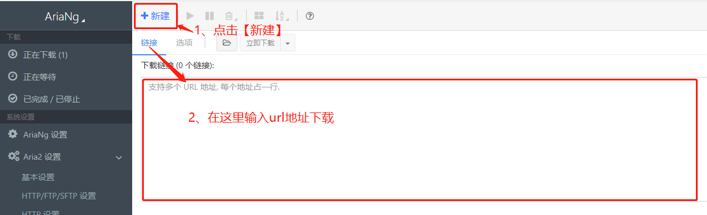

6. 还可以点击【新建】，点击【文件】，通过【打开种子文件】或者【打开Metalink文件】的方式下载电影。

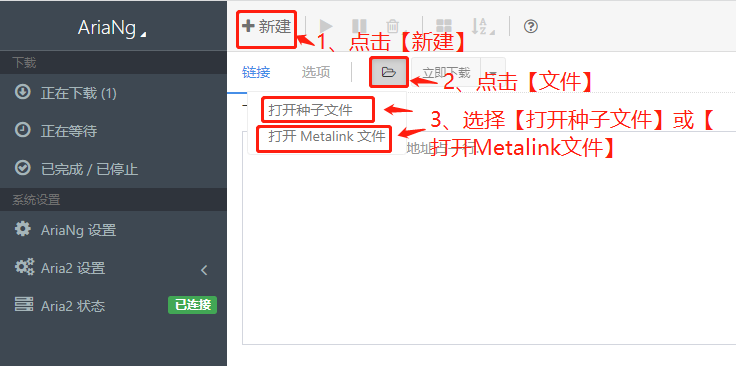

7. 选择电影【下载存放路径】，点击【立即下载】。

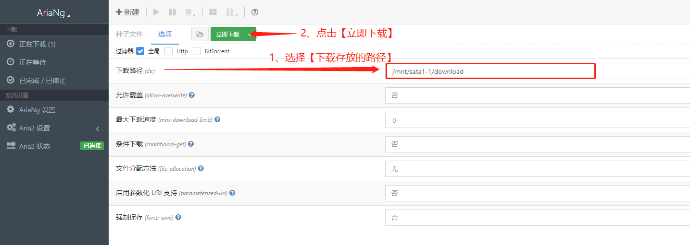

8. 可以看到电影正在下载中。

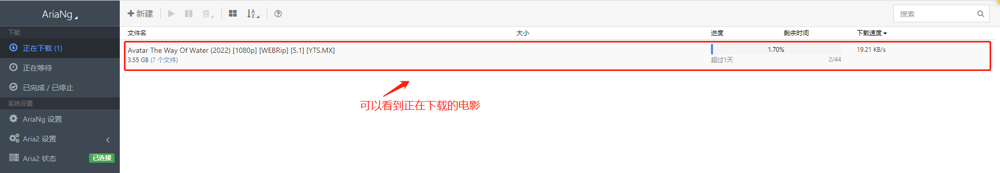

## qBittorrent下载器
**以OpenWrt为例**
- 注意：配置qBittorrent的时候，在【WebUI设置】页面，记得不要勾选【主机标头验证】，点击【保存并应用】。

1. 打开qBittorrent界面，点击【设置】。

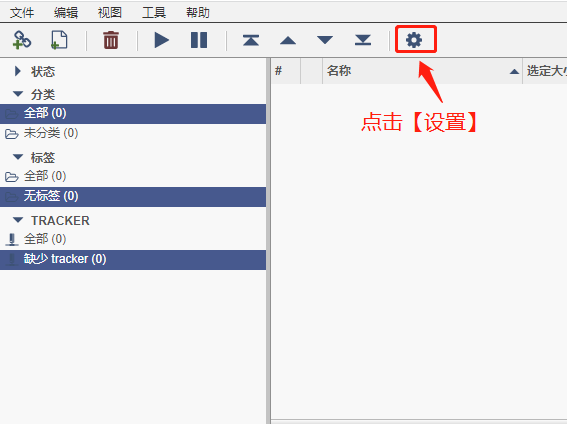

2. 点击【下载】，选择电影下载默认保存的路径。

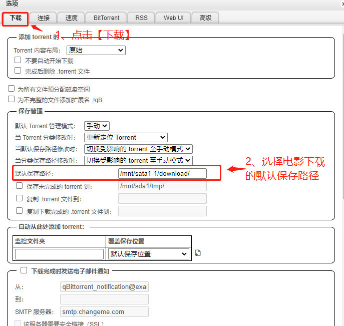

3. 点击【BitTorrent】，输入tracker链接，并勾选自动添加以下tracker到新的torrent，最后记得点击保存。

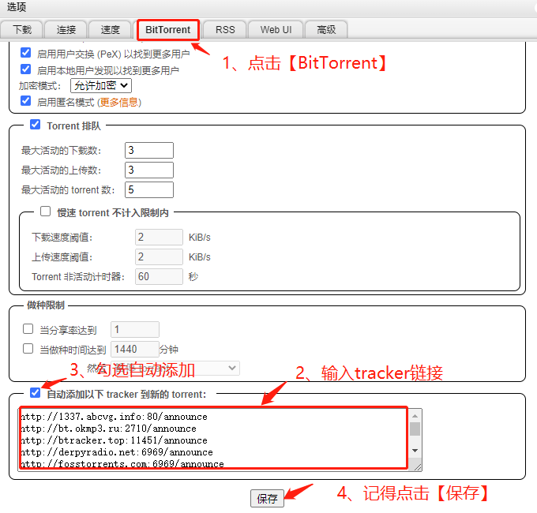

4. 点击【磁力链接】，在下方框内输入电影url或磁力链接，点击【下载】下载电影。

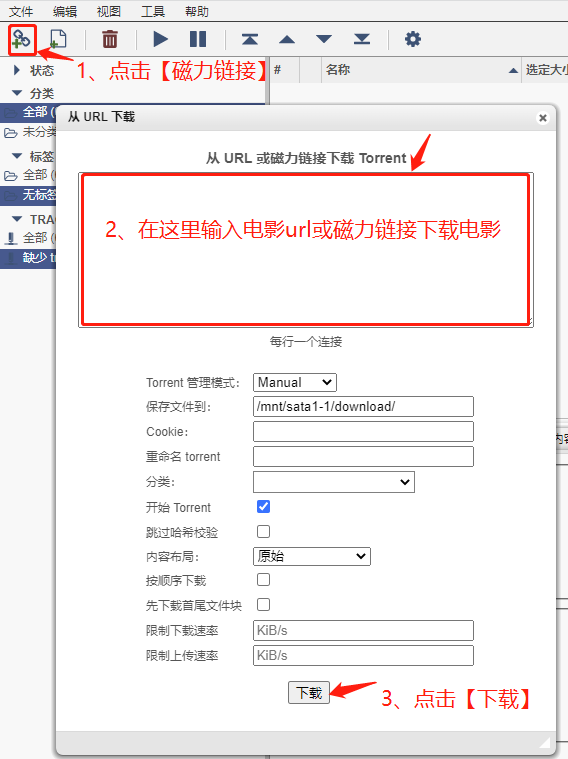

5. 点击【文件】，点击【选择文件】从本地选择电影，点击【上传Torrent】下载电影。

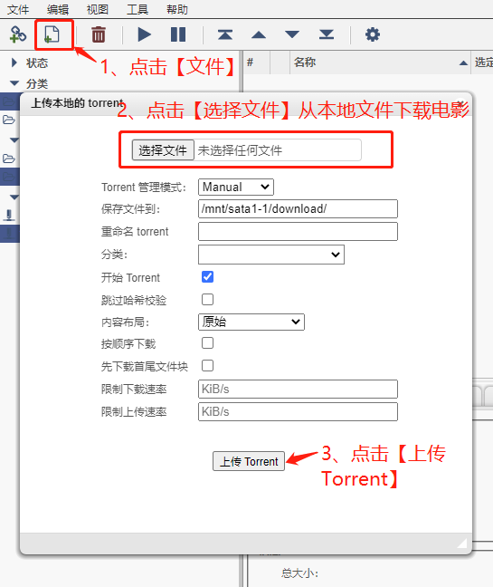

6. 可以看到电影正在下载。

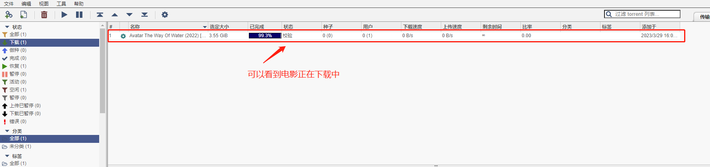

## Transmission下载器

1. 下载好Transmission后，进入Transmission界面，点击【设置】，点击【基本设置】，选择电影下载的【默认保存目录】，点击【保存】。

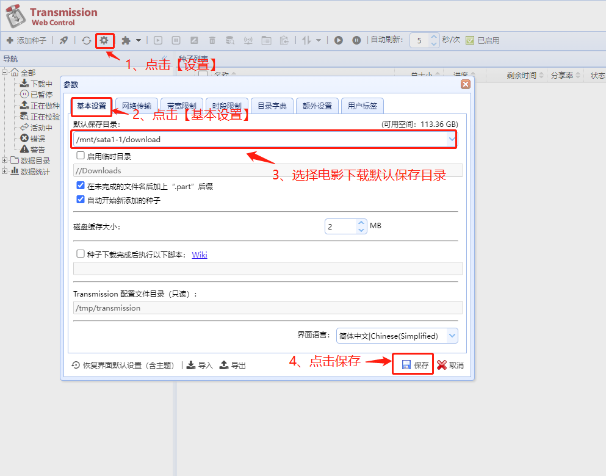

2. 点击【添加种子】，可以用【选择文件】添加本地电影下载，还可以用种子地址链接的方式下载电影，最后点击【确定】。

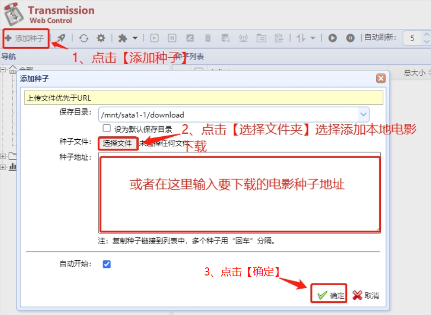

3. 可以看到电影正在下载中。

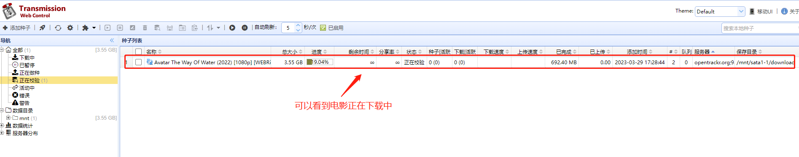