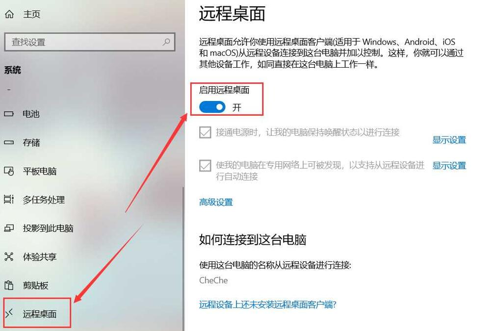
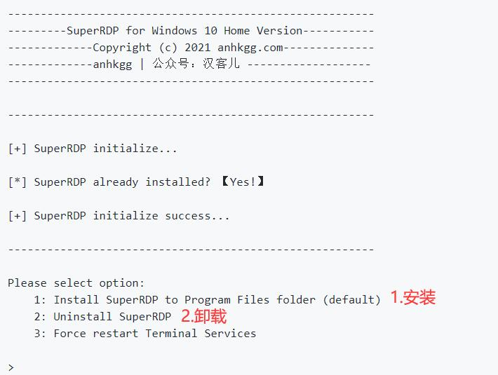
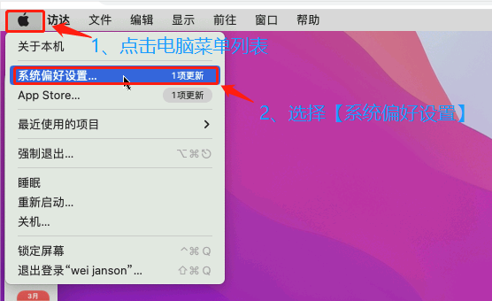
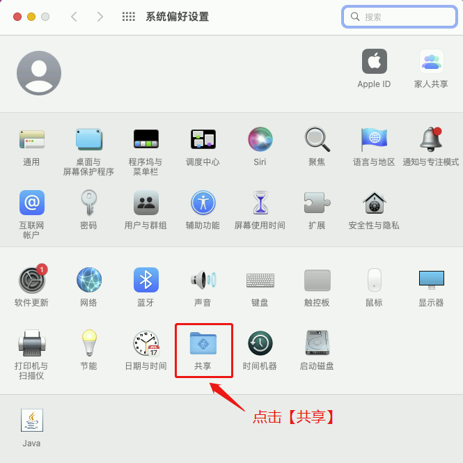
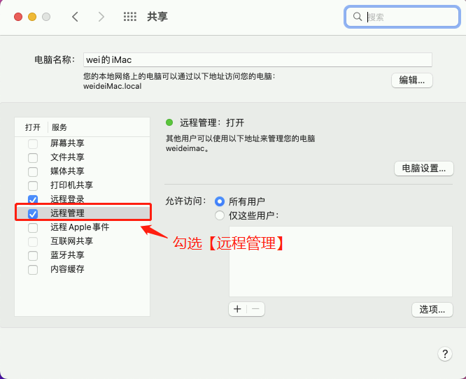
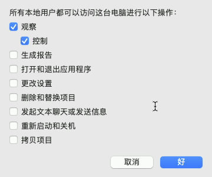

## 开启Windows RDP远程

### A.专业版开启RDP

**Windows专业版或者更高级的版本是有开关的，可以直接开启电脑的RDP。**

1. **Win11：** 设置——系统——远程桌面——启用

  

2. **Win10：** 设置——系统——远程桌面——启用远程桌面  

  

3. **Win7：** 右键我的电脑——属性——左边侧栏高级系统设置——远程，在下方“远程桌面”方框下勾选“允许远程连接到此计算机”
  
  

  ### B.家庭版开启RDP

**Windows家庭版是无法直接开启电脑的RDP，所以需要借助工具。**

1.首先，需要安装SuperRDP
 [点击进入下载](https://github.com/anhkgg/SuperRDP/releases)；

  

2.下载后解压，运行SuperRDP.exe(需管理员权限)；

  
  
运行后，根据提示选择1(安装)即可。
  
  

3. 验证远程桌面服务是否成功。

* Win+R，输入 mstsc.exe 启动远程桌面程序；

* 输入127.0.0.1，连接成功基本验证服务启用成功。

  

## 开启Mac VNC远程
1. 在电脑开始菜单列表，选择【系统偏好设置】。

  

2. 在系统偏好设置页面，打开【共享】。

 

3. 在打开的共享页面，勾选【远程管理】服务。

 

4. 在弹出的远程管理页面，选择远程控制选项后，点击【好】即可。

 

