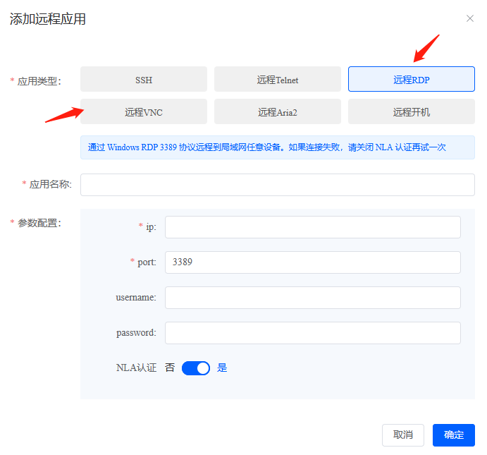

## 远程桌面选RDP还是VNC？

如果你要远程的电脑是Windows电脑，比如在家里连接到公司Windows电脑，那么最好使用RDP。  
因为RDP 是专门为 Windows 操作系统设计的，RDP比其他远程连接协议更快、更稳定，并且提供更高级的安全功能，可以让你的连接更安全。  
  

如果你需要在家里控制你公司的mac电脑，你可以使用VNC来远程控制它。  
虽然VNC相对于RDP协议来说更加灵活，可以在多种操作系统和平台上运行，但是它的传输速度较慢，安全性较差。

如果你想要不安装客户端只需要一个浏览器就能在任何地方远程桌面，可以用DDNSTO。

如果你想要体验更好、更流畅、更快、更稳定的远程你的电脑桌面，那么推荐使用易有云客户端。

